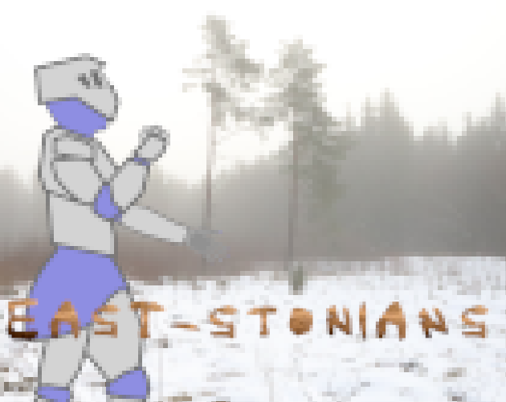

## Version v0.8d

A choice-based RPG set in 13th-century Eastern Europe.

In this demo version, you play as a member of the Divinian Brothers of the Sword, attempting to conquer the Eastern Lands.

Will the Crusade succeed, or will you be forced back to Saintnican? 

The wisest decisions are yours to make.

## Hosting

Game is hosted in <a href="https://kriimsilmlane02.itch.io/east-stonians-demo">itch.io</a>

## Technical

### Made in:
Microsoft Visual Studio Code

### Programming Languages Used:
* HTML
* CSS
* JavaScript

### Fonts Used:
* [Old London](https://www.dafont.com/old-london.font)
* [Airyin](https://www.dafont.com/airyin.font)

## Author

Andreas Selge